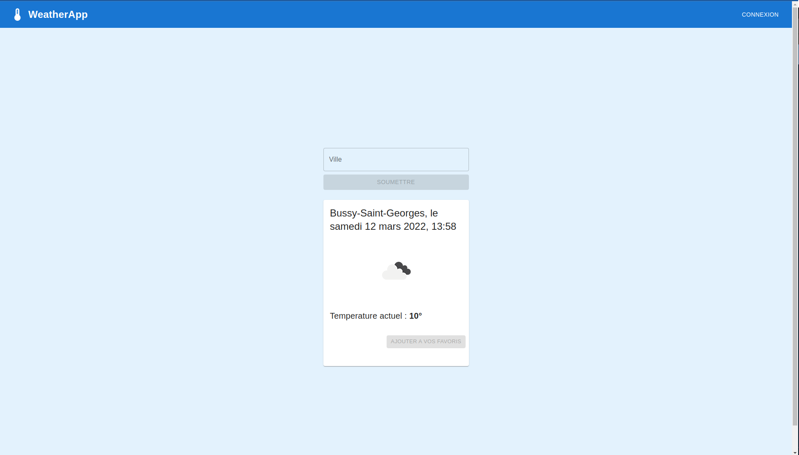

<div id="top"></div>

<!-- ABOUT THE PROJECT -->

## About The Project



## Getting Started

### Installation

2. Clone the repo
   ```sh
   git clone https://github.com/mhmdmrabet/weather-app-back
   ```
3. Install NPM packages
   ```sh
   npm install
   ```

### Launch the Project

```sh
npm run dev
```

<p align="right">(<a href="#top">back to top</a>)</p>

### Built With

- [Adonis.js](https://adonisjs.com/)
- [PostgreSQL](https://www.postgresql.org/)

<p align="right">(<a href="#top">back to top</a>)</p>

<!-- GETTING STARTED -->

<!-- USAGE EXAMPLES -->

## Usage

App allowing to search weather infos.

<p align="right">(<a href="#top">back to top</a>)</p>

<!-- CONTACT -->

## Contact

M'rabet Mohamed - [@MrabetMohamed94](https://twitter.com/MrabetMohamed94) - mhmdmrabet@yahoo.fr

Project Link: [WEATHER APP](https://weather-app-pied-omega.vercel.app/)

<p align="right">(<a href="#top">back to top</a>)</p>
